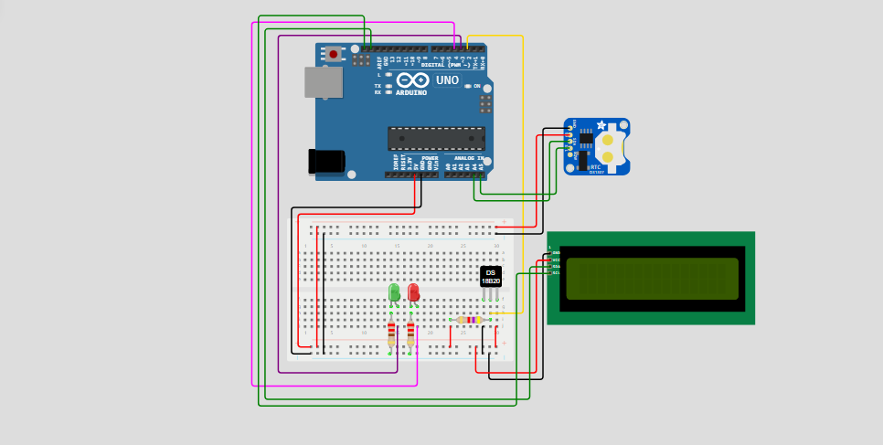

<h1 align='center'>
    CoralEco - Verificação de Temperatura
</h1>

<h3>
    Este projeto faz referência a todo um conjunto de projetos sobre a preservação dos recifes de corais. Assim, visando a conservação dos recifes de corais, temos um sistema de monitoramento de temperatura com registro de dados em um dispositivo Arduino. 
</h3>

  <a href="#participantes">Participantes</a> |
  <a href="#objetivos">Objetivos</a> |
  <a href="#hardware-utilizado">Hardware Utilizado</a> |
  <a href="#funcionamento-do-código">Funcionamento do Código</a> |
  <a href="#instalação-e-utilização">Instalação e Utilização</a> |
  <a href="#aviso">Aviso</a> 

## Participantes
1 ESPI - Engenharia de Software
* João Henrique Sena Hoffmann (RM550763)
* Vinicius Fernandes Tavares Bittencourt (RM558909)

## Objetivos
O objetivo deste projeto é poder fazer a captura das temperaturas próximas a recidfes de corais, assim é possível tomar medidas preventivas para se evitar o deterioramento dos corais, como ocorre no branqueamento, fenomêno onde o coral perde sua coloração e seus nutrientes.

## Hardware Utilizado
* Arduino Uno
* Sensor de temperatura (DS18B20)
* LEDs (Verde e Vermelho)
* Módulo Real Time Clock (RTC DS1307)
* Display LCD 16x2 com comunicação I2C

## Funcionamento do Código
O código lê o valor do sensor de temperatura (DS18B20), verificando se os valores recebidos estão entre a faixa adequada para a sobrevivência dos corais. Caso essa temperatura esteja fora da faixa adequada, o sistema fará a gravação da hora exata que ocorreu na memória EEPROM (memória não-volátil que armazena dados mesmo após o desligamento de energia). Junto a gravação da hora, o LED de cor vermelha indicará o valor fora da faixa ideal, caso contrário o LED verde ficará aceso. Após a verificação, o valor lido é apresentado no display LCD I2C. O código é executado em um loop contínuo, monitorando constantemente a temperatura, fornecendo feedback visual a qualidade da mesma.

## Instalação e Utilização
* Conecte os componentes conforme o esquema de ligação.
* Carregue o código para a placa Arduino.
* Faça o download das seguintes bibliotecas: OneWire, DallasTemperature, LiquidCrystal_I2C, RTClib, EEPROM.
* Ligue a alimentação da placa Arduino.
* Observe o display, os LEDs para monitorar a temperatura.

Este código implementa um sistema de monitoramento de temperatura com registro de dados em um dispositivo Arduino. Ele utiliza um sensor de temperatura, um display LCD I2C, um relógio em tempo real (RTC) e memória EEPROM para armazenar os dados.

## Aviso
Este projeto é uma prova de conceito e pode ser adaptado para atender outros valores referentes a temperatura.
